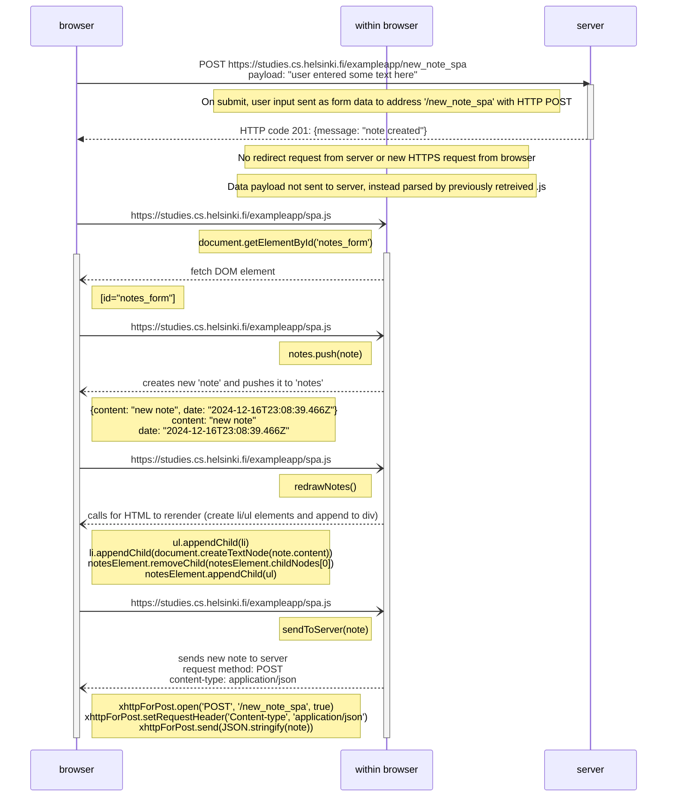

# Exercise 0.6
## SPA new note diagram

```mermaid
sequenceDiagram
    participant browser
    participant within browser
    participant server

    browser->>server: POST https://studies.cs.helsinki.fi/exampleapp/new_note_spa<br>payload: "user entered some text here"
    activate server
        Note over within browser: On submit, user input sent as form data to address  '/new_note_spa' with HTTP POST 
    server-->>browser: HTTP code 201: {message: "note created"}
    deactivate server
        Note over within browser: No redirect request from server or new HTTPS request from browser
        Note over within browser: Data payload not sent to server, instead parsed by previously retreived .js

    browser-)within browser: https://studies.cs.helsinki.fi/exampleapp/spa.js
        Note left of within browser: document.getElementById('notes_form')
    activate within browser
    activate browser
    within browser--)browser: fetch DOM element 
        Note right of browser: [id="notes_form"]

    browser-)within browser: https://studies.cs.helsinki.fi/exampleapp/spa.js
        Note left of within browser: notes.push(note)
    within browser--)browser: creates new 'note' and pushes it to 'notes'
        Note right of browser: {content: "new note", date: "2024-12-16T23:08:39.466Z"}<br>content: "new note"<br>date: "2024-12-16T23:08:39.466Z"

    browser-)within browser: https://studies.cs.helsinki.fi/exampleapp/spa.js
        Note left of within browser: redrawNotes()
    within browser--)browser: calls for HTML to rerender (create li/ul elements and append to div)
        Note right of browser: ul.appendChild(li)<br>li.appendChild(document.createTextNode(note.content))<br>notesElement.removeChild(notesElement.childNodes[0])<br>notesElement.appendChild(ul)


    browser-)within browser: https://studies.cs.helsinki.fi/exampleapp/spa.js
        Note left of within browser: sendToServer(note)
    within browser--)browser: sends new note to server<br>request method: POST<br>content-type: application/json
        Note right of browser:   xhttpForPost.open('POST', '/new_note_spa', true)<br>xhttpForPost.setRequestHeader('Content-type', 'application/json')<br>xhttpForPost.send(JSON.stringify(note))
    deactivate within browser
    deactivate browser
```